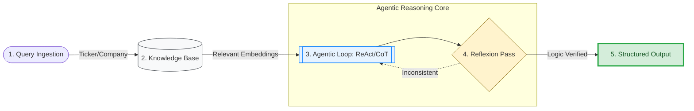

# 📈 MarketMind AI: Intelligent Financial Investigator

**MarketMind AI** is an autonomous financial analyst powered by a Multi-Agent generative AI architecture. Built with **Streamlit**, it goes beyond standard chat interfaces by implementing self-correcting reasoning loops to provide high-conviction, data-backed investment strategies.

---

## 🧠 Deep Dive: Why These Reasoning Techniques?

In financial analysis, a "hallucination" isn't just a mistake—it’s a risk. MarketMind AI uses a three-pillar reasoning strategy to ensure every "Final Verdict" is logically sound.

### 1. ReAct (Reason + Act)
Traditional LLMs are "frozen" in time based on their training data. By using the **ReAct** framework, the agent follows a cycle of **Thought → Action → Observation**. 
* **Why it’s crucial:** If you ask about a specific stock, the agent *reasons* that it needs current prices, *acts* by querying a financial API or scraping news, and *observes* the data before responding. This eliminates the "knowledge cutoff" problem.


### 2. Chain of Thought (CoT)
Financial decisions are multi-layered. One cannot evaluate a stock without first understanding the macroeconomic environment. 
* **Why it’s crucial:** CoT forces the model to decompose the problem. It analyzes inflation and interest rates (Step 1), then sector trends (Step 2), and finally company fundamentals (Step 3). This linear transparency allows the user to follow the "why" behind the "what."


### 3. Self-Reflection / Reflexion (The Critic Agent)
Inspired by modern agentic workflows, we implemented a **Reflexion** step (Step 6 in the UI). 
* **Why it’s crucial:** Before the final output is rendered, a separate "Critic" pass evaluates the internal thought process. If the analysis suggests high risk but the conclusion suggests "Entry," the Reflexion agent triggers a self-correction. This provides a digital "second opinion" to prevent logical drift.


---

## 🏗️ System Architecture & Structure

MarketMind AI is built as an **Agentic RAG (Retrieval-Augmented Generation)** system. Here is how the technical components interact:


### The Tech Stack
* **Frontend:** **Streamlit** handles the reactive UI, displaying the agent's internal thought process in real-time.
* **Orchestration:** **LangChain** manages the multi-agent handoffs between the "Researcher" and the "Analyst."
* **LLM Engine:** **OpenAI GPT-4o-mini** acts as the core Transformer, utilizing its massive parameter count to handle complex financial cross-attention.
* **External APIs:** * **Financial Data:** Yahoo Finance for real-time tickers.
    * **Search:** Tavily for scraping high-signal financial news.

### The Workflow Sequence



---

## 🛠️ Key Features

* **Visual Thought Process:** Don't just see the answer—see the "Thinking..." status blocks as the model navigates Step 1 through Step 6.
* **Green Box Verdicts:** Most critical data (Hold/Entry/Exit) is highlighted in high-visibility success containers for quick decision-making.
* **Risk Sensitivity:** Geopolitical risk weights are adjusted dynamically based on real-time news sentiment.

---

## 🚀 Installation & Setup

### For Linux/macOS:
1. **Clone the repo:** 
```bash
   git clone https://github.com/Zaid-MAHSOUNE/market-mind-ai.git
```
2. **Create a virtual env:** 
```bash
   python -m venv market_env
```
3. **Activate the virtual env:** 
```bash
   source market_env/bin/activate
```
4. **Install dependencies:** 
```bash
   pip install -r requirements.txt
```
5. **Run the app:** 
```bash
   streamlit run app.py
```

### For Windows:
Please refer to the [official Python VirtualEnv guide](https://www.w3schools.com/python/python_virtualenv.asp) for activation instructions (`.\market_env\Scripts\activate`).

---

**MarketMind AI** turns raw market noise into actionable intelligence by applying the rigorous mathematical foundations of Transformers to the volatile world of finance. 